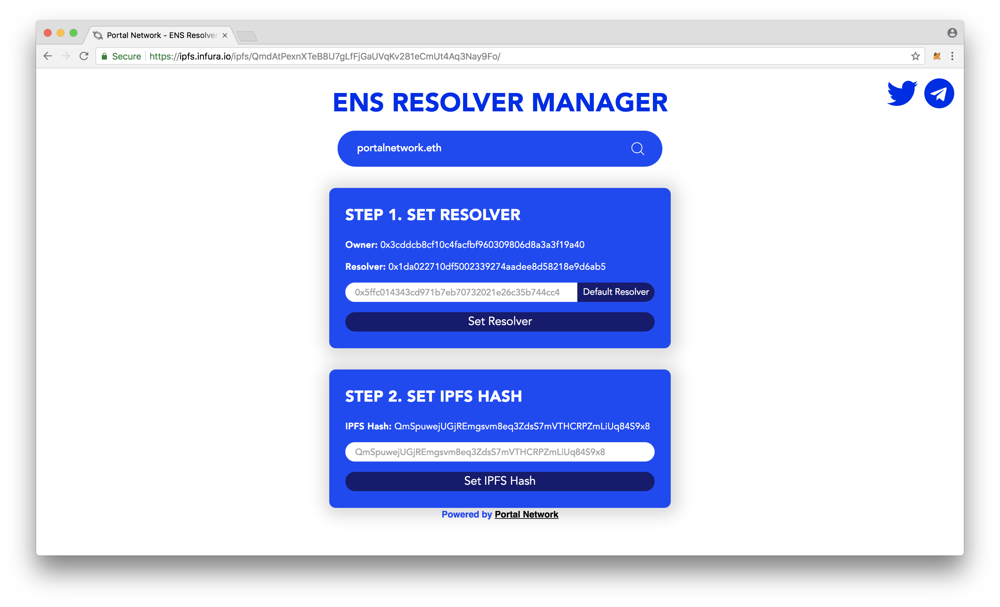

# ENS Resolver Manager

> Easily set IPFS hash to the ENS Resolver

## Usage



## How To Install Dependencies

Install project dependencies:
```
npm install
```

Start the project:
```
npm start
```
Open your browser at `localhost:3000` and open MetaMask to interact with this DApp.

## Contributing
See [CONTRIBUTING.md](./CONTRIBUTING.md) for how to help out.

## Licence
See [LICENSE](./LICENSE) for details.
